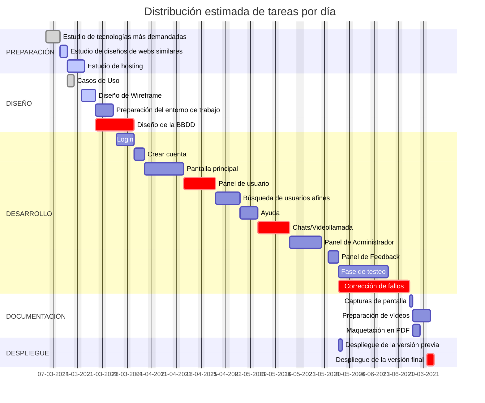
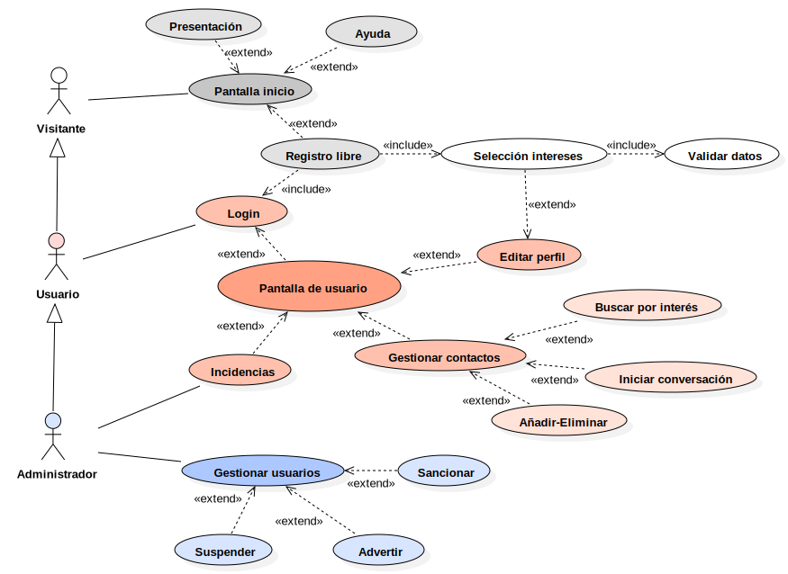

### Diagrama de GANTT de las tareas del proyecto PAREA

```mermaid
gantt
    dateFormat  DD-MM-YYYY
    axisFormat  %d-%m-%Y
    title       Distribución estimada de tareas por día
    excludes    weekends
    %% (`excludes` accepts specific dates in YYYY-MM-DD format, days of the week ("sunday") or "weekends", but not the word "weekdays".)

    section PREPARACIÓN
    Estudio de tecnologías más demandadas : done, 05-03-2021, 2d
    Estudio de diseños de webs similares : active, 2d
    Estudio de hosting: active, 3d

    section DISEÑO
    Casos de Uso : done, dis1, 11-03-2021, 2d
    Diseño de Wireframe : active, dis2, after dis1, 4d
    Preparación del entorno de trabajo: dis3, after dis2, 3d
    Diseño de la BBDD : crit, dis_fin, after dis2, 7d

    section DESARROLLO
    Login : front1, 25-03-2021, 3d
    Crear cuenta : front2, after front1, 3d
    Pantalla principal : front3, after front2, 7d
    Panel de usuario : crit, front4, after front3, 7d
    Búsqueda de usuarios afines : front5, after front4, 5d
    Ayuda : front6, after front5, 3d
    Chats/Videollamada : crit, front7, after front6, 7d
    Panel de Administrador : front8, after front7, 7d
    Panel de Feedback: front9, after front8, 3d
    Fase de testeo : des2, after front9, 10d
    Corrección de fallos : crit, des_fin, after front9, 14d

    section DOCUMENTACIÓN
    Capturas de pantalla: doc1, after des_fin, 1d
    Preparación de vídeos: 3d
    Maquetación en PDF: doc_fin, after doc1, 2d

    
    section DESPLIEGUE
    Despliegue de la versión previa: after front9, 1d
    Despliegue de la versión final : crit, desp1, after doc_fin, 2d
```

### Diagrama de caso de uso del proyecto PAREA

